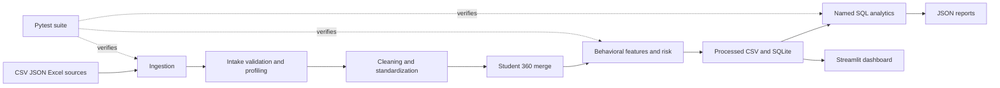
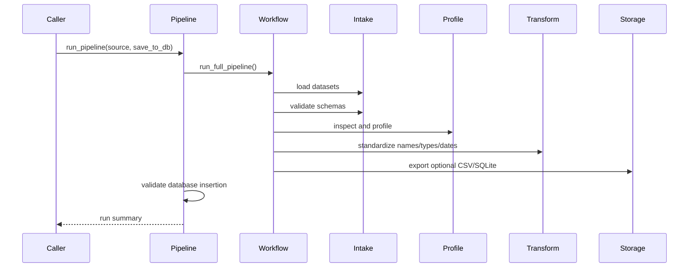
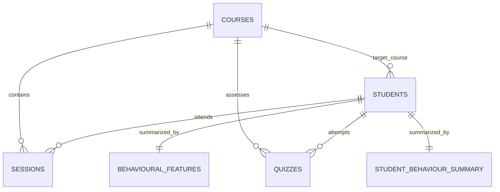

# High-Level Design

## 1. System Context

Learning Behaviour & Course Completion Intelligence is a local, batch-oriented analytics system. Files enter through the raw-data directory or Python APIs. Pandas performs data preparation and feature computation. SQLite provides a relational analytical store. SQL scripts produce business views and JSON reports. Streamlit is the presentation shell.

## 2. Architectural Style

The implementation is a modular batch pipeline with a lightweight analytical serving layer:

- **Functional core:** DataFrames, pure-ish transformations, validators, aggregators, and vectorized formulas.
- **Orchestration:** `DataWorkflow`, `run_pipeline`, and standalone scripts.
- **Persistence:** filesystem exports and SQLite.
- **Presentation:** Streamlit components.
- **Quality boundary:** typed exceptions, structured reports, logging, and pytest.

There is no network API, message broker, scheduler, model registry, or external warehouse in the current repository.

## 3. Major Components

### 3.1 Entry points

- `main.py`: verifies environment, creates directories, initializes SQLite, and invokes the generic `src.pipeline.run_pipeline()`.
- `src/pipeline.py`: wraps `DataWorkflow` and optionally validates database insertion.
- `scripts/sql_integration.py`: operational database integration path; loads source data or deterministic sample data, builds behavioral features, loads SQLite, validates tables, and writes a summary.
- `scripts/sql_business_metrics.py`: populates the database and runs named KPI queries.
- `scripts/sql_aggregation.py`: populates the database and runs named cohort/aggregation queries.
- `dashboard/app.py`: Streamlit UI shell with navigation and placeholder KPI cards.

### 3.2 Ingestion and quality

`src.ingestion` loads CSV, JSON, and Excel into DataFrames, supports flexible JSON structures, discovers standard entities, and optionally validates an entity schema. `src.validation` validates files, required columns, minimum rows, and intake status. `src.inspection` and `src.profiling` provide structural and statistical quality metadata. `src.consistency` applies domain rules and creates violation reports.

### 3.3 Cleaning and transformation

`src.cleaning` composes deduplication, text cleaning, imputation, and entity standardization. Supporting modules are `deduplication.py`, `imputation.py`, `text_cleaning.py`, `standardization.py`, `transformation.py`, and `datetime_pipeline.py`. The generic `DataWorkflow.transform()` currently standardizes column names and applies configured type/date mappings; full domain cleaning is available through the cleaning APIs and scripts.

### 3.4 Relational integration

`src.merging` first aggregates sessions and quizzes by student, then performs left joins from students to courses, aggregated sessions, and aggregated quizzes. `JoinAuditReport` and `JoinValidationSummary` expose row counts, unmatched records, and expansion factors. This design preserves the student universe while preventing raw event-table multiplication.

### 3.5 Feature and risk layer

`src.features` computes Student 360 derived features. `src.vectorization` supplies NumPy implementations for scaling, standardization, engagement, risk, and risk tiers. `src.feature_engineering.py` contains a placeholder baseline function and should not be confused with `src.features.py`, which is the implemented behavioral feature path.

### 3.6 Persistence and query layer

`src.database` initializes schema, opens connections, loads SQL query files, executes queries, and validates expected tables. `src.storage` writes CSV/JSON and DataFrames to SQLite. `sql/schema.sql` defines six tables; `business_metrics.sql` defines executive and category KPIs; `aggregation.sql` defines five analytical query families.

### 3.7 Presentation and artifacts

Reports are written below `output/`, including KPI summaries, SQL aggregation results, join audits, imputation decisions, deduplication summaries, and validation artifacts. `reports/` is reserved for executive/charts/insights outputs. The dashboard currently renders navigation and static values but does not consume the report/database layer.

## 4. End-to-End Runtime Flows

### 4.1 Generic workflow

### 4.2 SQL integration flow

1. Ensure directories and initialize schema.
2. Discover raw core entities.
3. If no raw entity has rows, generate seeded sample data.
4. Build Student 360 using left joins and event aggregation.
5. Engineer behavioral features and risk.
6. Replace/load `students`, `courses`, `sessions`, `quizzes`, and `behavioural_features` tables.
7. Validate table presence and row counts.
8. Run verification SQL and save `output/sql_integration_summary.json`.

## 5. Logical Data Model

The two student summary tables are analytical tables. `behavioural_features` is populated by the current SQL integration script; `student_behaviour_summary` is defined in the schema but is not populated by that script.

## 6. Deployment and Operations

The intended current deployment is a developer or analyst workstation:

- Python environment installed from `pyproject.toml` or `requirements.txt`.
- Local filesystem for raw, processed, report, and output artifacts.
- SQLite file at `data/database/learning_analytics.db`.
- CLI execution for pipeline/scripts and Streamlit process for UI.
- Pytest in local or CI automation.

A future deployment can package the batch job and dashboard separately, but should replace shared mutable filesystem assumptions with managed storage and explicit run metadata.

## 7. Cross-Cutting Concerns

- **Observability:** module loggers, timed-step decorator, structured report dictionaries, and persisted JSON/CSV audits.
- **Error handling:** `DataLoadError`, `ValidationError`, `TransformationError`, and `DataExportError`; callers choose whether intake validation raises.
- **Security:** no authentication or authorization is implemented; raw data and SQLite are local assets and require filesystem access controls.
- **Data privacy:** student demographic fields are sensitive; reports should minimize identifiers and restrict access in any shared deployment.
- **Idempotency:** schema creation is `IF NOT EXISTS`; data loads default to replacement; deterministic synthetic data uses fixed seeds.
- **Consistency:** canonical category mappings and explicit formulas reduce semantic drift between Python and SQL.

## 8. Current Constraints and Design Gaps

1. `main.py` executes the generic foundation workflow, not the complete SQL integration path.
2. The generic workflow has no default type mappings/date mappings and does not automatically call `src.cleaning` or `src.features`.
3. The dashboard is not wired to the database and displays hard-coded sample numbers.
4. No scheduler, freshness contract, schema versioning, retention policy, or lineage store exists.
5. SQLite foreign-key clauses are declared in schema but connection-level foreign-key enforcement is not explicitly enabled.
6. Heuristic risk tiers are suitable for analysis and prioritization, not clinical, disciplinary, or fully automated decisions.

## 9. Recommended Evolution

Create one production orchestrator that calls ingestion, quality checks, cleaning, merging, feature engineering, database load, and report generation in a single explicit run. Add run IDs, source timestamps, synthetic-data markers, data-quality gates, and dashboard queries against the validated database. Only then introduce cloud scheduling, concurrent serving, or calibrated predictive models.
