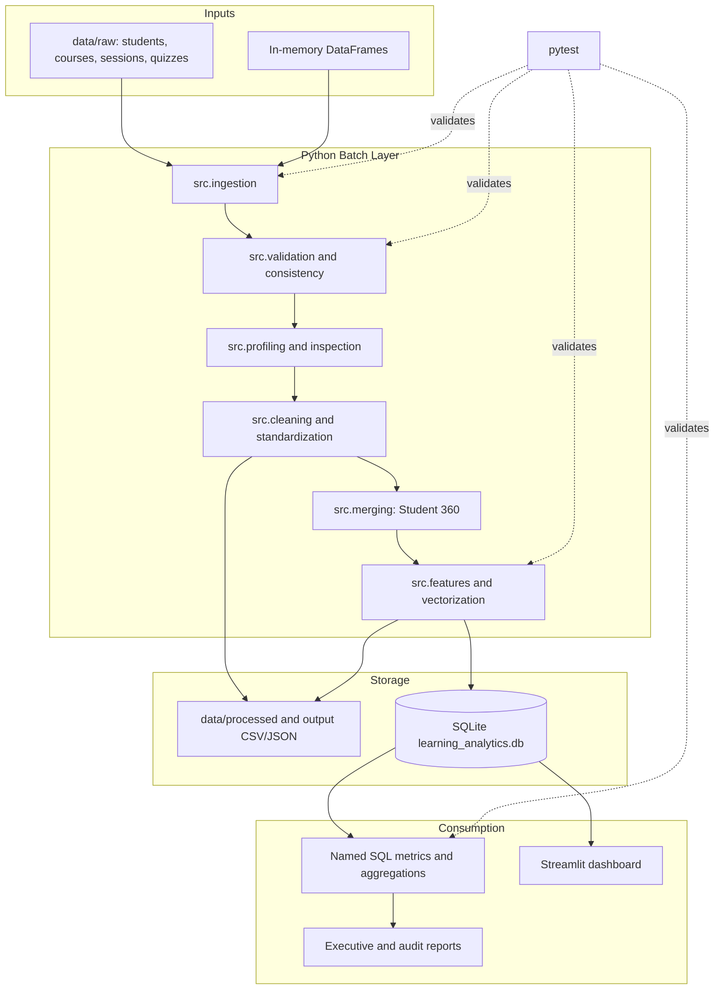
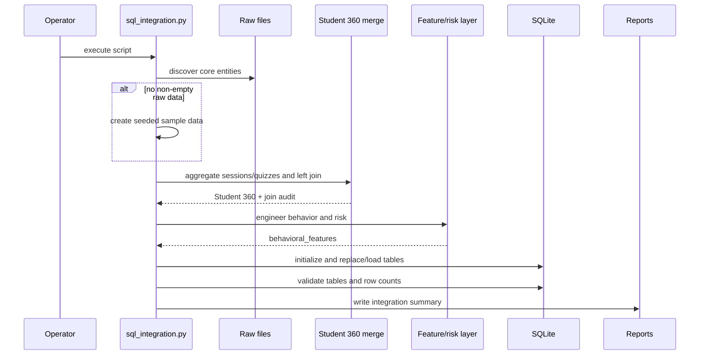

# System Design

## Executive Summary

The repository implements a local batch analytics system for learning behavior and course completion. It has four important execution surfaces:

1. A reusable Python workflow for loading, validating, profiling, transforming, and exporting DataFrames.
2. A domain analytics path that merges student, course, session, and quiz data into Student 360 records and computes behavioral/risk features.
3. A SQLite and SQL reporting layer for business KPIs and cohort analysis.
4. A Streamlit dashboard shell and a broad pytest suite.

The design is intentionally transparent: each business metric is derived from named SQL or Python formulas, and data-quality operations produce diagnostics instead of silently hiding defects.

## Architecture at a Glance



## Design Principles

- **Student grain is the analytical anchor.** Event tables are aggregated to student grain before joining.
- **Data quality is a first-class output.** Validation and joins report what was rejected, unmatched, or expanded.
- **Formulas are interpretable.** Engagement and risk use explicit weighted components.
- **Batch first.** The current repository favors reproducible local runs over operational complexity.
- **Separate domain paths.** EdTech tables and the standalone customer/order exercises are not the same product schema.
- **One source of truth for query semantics.** SQL files hold named business queries; Python parses and executes them.

## Runtime Modes

### Generic pipeline mode

`main.py` initializes the environment and SQLite schema, then calls `run_pipeline()`. `DataWorkflow` loads the configured source, validates, inspects/profiles, applies configured basic transformations, and optionally exports. This path is useful as a reusable foundation but is not the complete behavioral analytics build.

### SQL integration mode

`scripts/sql_integration.py` is the most complete domain path:



### SQL reporting mode

The KPI and aggregation scripts prepare/load the database, parse `-- Name:` query blocks, execute each query, print results, and write JSON summaries. Queries use joins to students, courses, sessions, quizzes, and behavioral features.

## Domain Data Model

| Entity | Grain | Key | Main use |
| --- | --- | --- | --- |
| `courses` | One row per course | `course_id` | Curriculum metadata |
| `students` | One row per learner/enrollment | `student_id` | Learner attributes and completion outcome |
| `sessions` | One row per learning session | `session_id` | Activity telemetry |
| `quizzes` | One row per quiz attempt | `quiz_attempt_id` | Assessment performance |
| `behavioural_features` | One row per learner | `student_id` | Derived metrics and risk |
| `student_behaviour_summary` | One row per learner | `student_id` | Reserved summary schema |

The intended relationships are student-to-course enrollment, student-to-many sessions, student-to-many quiz attempts, and student-to-one behavioral feature summary.

## Processing Contract

### Intake

Supported file extensions are CSV, JSON, XLSX, and XLS. Entity discovery checks for `<entity>.csv` then `<entity>.json` in `data/raw/`. JSON supports lists, `data` arrays, `records` arrays, dictionaries of records, and single dictionaries.

### Structural quality

Required schemas and source checks are implemented in `src/validation.py`. A dataset is invalid when it is absent, empty, has no columns, has fewer than the minimum rows, or lacks required fields. Validation can return reports or raise a typed exception.

### Domain quality

`src/consistency.py` checks identifiers, student statuses/ages, session durations/timestamps, quiz score ranges, and related rules. Violations are represented as `RuleViolation` records and summarized in `ConsistencyReport`. This layer flags rather than silently edits data.

### Cleaning

The domain cleaning composition is deduplication, text normalization, imputation, and standardization. It is intentionally separate from the generic workflow so callers can choose policy and retain audit information.

### Merge and feature grain

The merge pipeline always aggregates sessions and quizzes by `student_id` before joining. Missing activity and assessment aggregates become zeros for students without events. Course progress is based on passed quizzes and total course quizzes, capped at 100 percent.

### Scoring

Engagement is a weighted 0-100 index composed of progress, quiz pass rate, weekly frequency, and active-learning ratio. Risk combines inverse engagement, inactivity penalty, and low quiz-pass penalty. Tiers are Low, Moderate, High, and Critical. Scores should support prioritization and investigation, not automatic adverse action.

## Persistence and Reporting

SQLite is initialized from `sql/schema.sql` at `data/database/learning_analytics.db`. Pandas `to_sql` writes the data. Current default loading replaces existing tables, which makes local runs repeatable but is not an append-only warehouse strategy.

Named SQL outputs:

- `business_metrics.sql`: completion rate, dropout rate, average quiz score, average session duration, active learners, at-risk learners, executive overview, and category breakdown.
- `aggregation.sql`: course performance, learner/device segments, high inactivity risk, age demographics, and quiz performance.

Artifacts include `business_metrics_report.json`, `sql_aggregation_report.json`, `sql_integration_summary.json`, and data-quality audit files under `output/`.

## Operational Controls

- Use `ensure_directories_exist()` before filesystem/database operations.
- Use module loggers and `timed_step` for step timing and failure visibility.
- Validate database table existence and row counts after loading.
- Preserve source-to-output audit artifacts for duplicate removal, imputation, joins, and validation.
- Run `python -m pytest` before accepting changes.
- Treat the seeded sample fallback as synthetic and never present it as production data.

## Reliability, Security, and Privacy

The system is reliable for local batch analytics when source files and Python dependencies are available. It has no network boundary, authentication, authorization, encryption, secrets management, or row-level access control. Student demographic and behavioral data must therefore remain in controlled filesystem/database locations in any real use. A production deployment would need access controls, encrypted storage, run isolation, data retention, and privacy review.

## Current-State Gaps

- The dashboard displays static KPI values and does not query SQLite.
- `main.py` runs the foundational workflow but not the complete behavioral SQL integration sequence.
- The generic workflow does not automatically perform domain cleaning or feature engineering.
- `student_behaviour_summary` is defined but not populated by the integration script.
- There is no scheduler, freshness SLA, run metadata, schema migration mechanism, or external API.
- Risk thresholds and weights are heuristic and need validation against future outcomes.

## Target Evolution

The next coherent version should add a single orchestrator with explicit stages and a run manifest:

```text
source manifest
  -> intake and quality gate
  -> cleaning with audit
  -> Student 360 and join gate
  -> features and risk
  -> transactional database load
  -> SQL report materialization
  -> dashboard query layer
  -> run manifest and alerts
```

That evolution should preserve the current module boundaries and formulas while adding data freshness, lineage, synthetic-data markers, dashboard queries, schema versioning, and calibrated risk evaluation.
